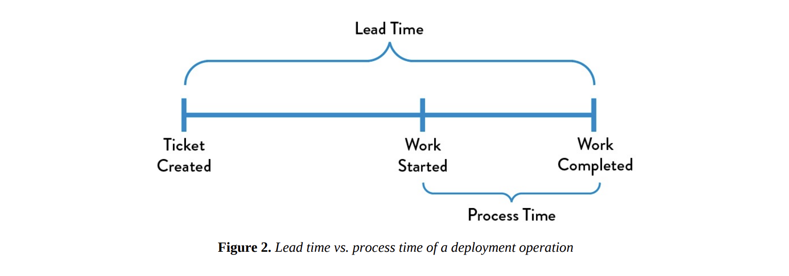
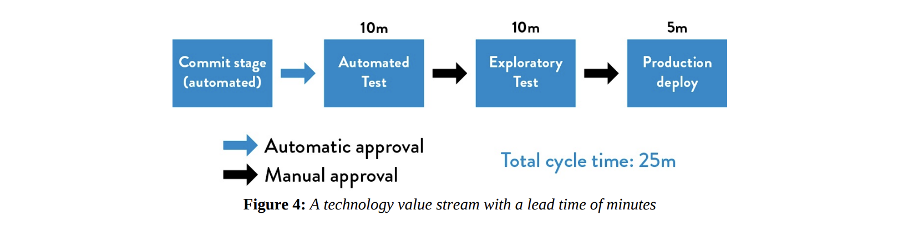

# Agile, Continuous Delivery, and the Three Ways
- In this chapter, an introduction to the underpinning theory of Lean Manufacturing is presented, as well as the Three Ways, the principles from which all of the observed DevOps behaviours can be derived

## The Manufacturing Value Stream
- One of the fundamental concepts in Lean is the *value stream*
    - Value stream: The sequence of activities an organization undertakes to deliver upon a customer request or the sequence of activities required to design, produce, and deliver a good or service to a customer
- In manufacturing operations, the value stream is often easy to see and observe: it starts when a customer order is received and the raw materials are released onto the plant for
- To enable fast and predictable lead times in any value stream there is often relentless focus on creating a smooth work flow using techniques such as small batch sies, reducing work in progress (WIP), and prevent rework to ensure we don't pass defects downstream

## The Technology Value Stream
- The same principles and patterns that enable the fast flow of work in physical processes are equally applicable to technology work
- In DevOps, we typically define our technology value stream as the process required to convert a business hypothesis into a technology-enabled service that dlivers value to the customer
- The input to our process is the formulation of a business objective, concept, idea, or hypothesis, and starts when we accept the work in Development, adding it to our backlog
- As value is created only when our services are running in production, we must ensure that we are not only delivering fast flow, but that deployments can be performed without disruptions such as service outages, service impairements

## Focus on Deployment Lead Time
- This value stream begins when any engineer in our value stream (Dev, QA, IT, Ops, Infosec) checks a change into version control and ends when that change is successfully running in production, providing value to the customer and generating useful feedback and telemetry
- The first phase of work includes Design and Development is akin to Lean Product Development and is highly variable and uncertain, resulting in high variability of process times
- The second phase of work: Testing and Operations (akin to Lean Manufacturing) strives to be predictable and mechanistic, with the goal of achieving work outputs with minimizes variability
- Our goal is to have testing and operations happening simulatenously with design/development rather then having them happen sequentially

## Definng Lead Time vs Process Time
- Lead time is one of two measures commonly used to measure performance in value streams, with the other being processing time
-  The lead time clock starts when the request is made and ends when it is fulfilled, the process time clock starts only when we begin work on the customer request, it omits the time that the work is in queue, waiting to be processed

- Because lead time is what the customer experiences, we typically focus our process improvement attention there instead of process time
- However, the proportion of process time to lead time serves as an important measure of efficiency

## The Common Scenario: Deployment Lead Times Requiring Months
- In business, we often find ourselves in situations where our deployment lead times require months
- This is especially common in large, complex organizations that are working with tightly-coupled, monolithic applications, often with scarce integration test environments, long test and production lead times, high reliance on manual testing, and multiple required approval processes

## Our DevOps Ideal: Deployment Lead Times of Minutes
- In the DevOps ideal, developers receive fast, constant feedback on their work. which enables them to quickly and independently implement, integrate, and validate, and have the code deployed into the production environment
- We achieve this by continually checking s,all code changes into our version control, performing automated and explaratory testing and deploying it into production
- This enables us to have a high degree of confidence that our changes will operate as designed in production and that any problems can be quickyl detected and corrected
- This is most easily achieved wth well encapsulated, loosely-coupled architecture, with failures being small and contained and without causing global disruptions
- Our resulting stream map should look like:

## Observing "%C/A" As a Measure of Rework
- In additiona to lead times and process times, the third key metirc in the tech value stream is percent complete and accurate hence (*%C/A*)
- This metric reflects the quality of the output of each step in our value stream
- This can be obtained by asking downstream customers what percentage of time they receive work that is "usable as is"

## The Three Ways: The Principle of Underpinning Devops
1. The First Way: Flow (Left to Right)
- Focus: Streamline the flow of work from Development to Operations, eventually reaching the customer.
- Goal: Reduce lead times for deploying code into production, improve throughput, and increase the overall quality of work.
- Practices: Continuous integration, continuous delivery (CI/CD), creating environments on demand, limiting work in progress (WIP), and building systems that are safe to change.
- Outcome: Faster delivery of features or products, allowing the organization to outpace competitors.
2. The Second Way: Feedback (Right to Left)
- Focus: Enable quick and constant feedback at every stage of the value stream, from Operations back to Development.
- Goal: Identify and fix problems early, before they escalate into larger issues. Amplifying feedback helps improve quality and prevent recurring problems.
- Practices: Detect and address issues as soon as they arise, create feedback loops that allow for quick identification and resolution of defects, and embed knowledge in the process.
- Outcome: Continuous improvement and learning, along with higher-quality systems that catch and fix problems early.
3. The Third Way: Continuous Learning and Experimentation
- Focus: Foster a culture of experimentation, risk-taking, and learning from both successes and failures.
- Goal: Create a high-trust environment that encourages innovation, learning, and systemic improvements across the organization.
- Practices: Build systems that encourage knowledge sharing, enable experimentation, and support a disciplined approach to risk-taking.
- Outcome: A learning organization that adapts quickly, making discoveries that lead to long-term, widespread improvements across the organization.